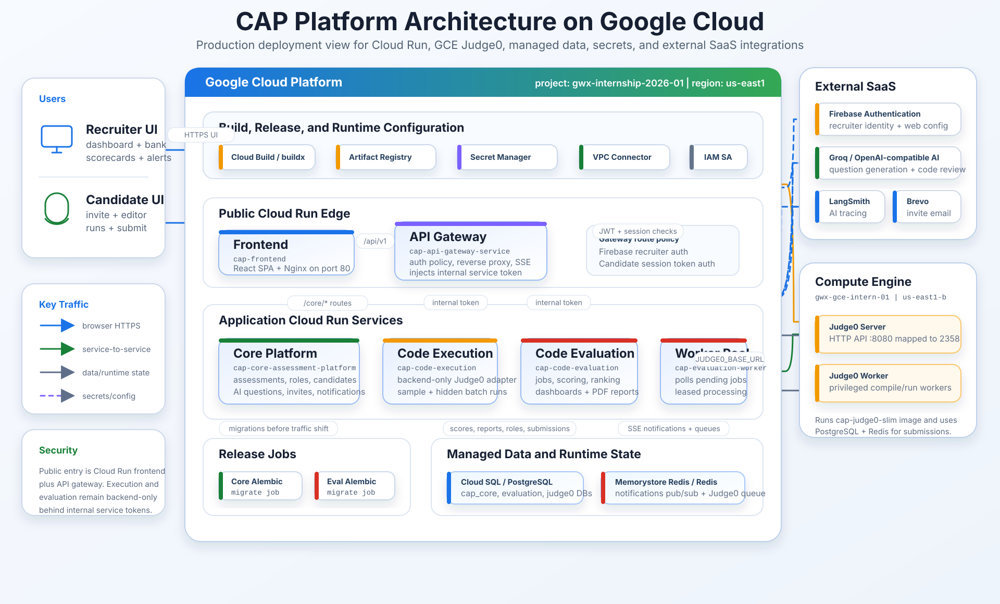

# CAP GCP Platform Architecture

HD PNG version: [`cap-gcp-platform-architecture-hd.png`](images/cap-gcp-platform-architecture-hd.png)

This diagram is based on the repository's Cloud Run deployment scripts, Docker
Compose topology, and service documentation. It shows the production GCP shape:
Cloud Run frontend, gateway, core, execution, evaluation, worker pool,
migration jobs, Secret Manager, Artifact Registry, VPC connector, managed
PostgreSQL/Redis state, Judge0 on Compute Engine, and external SaaS providers.
