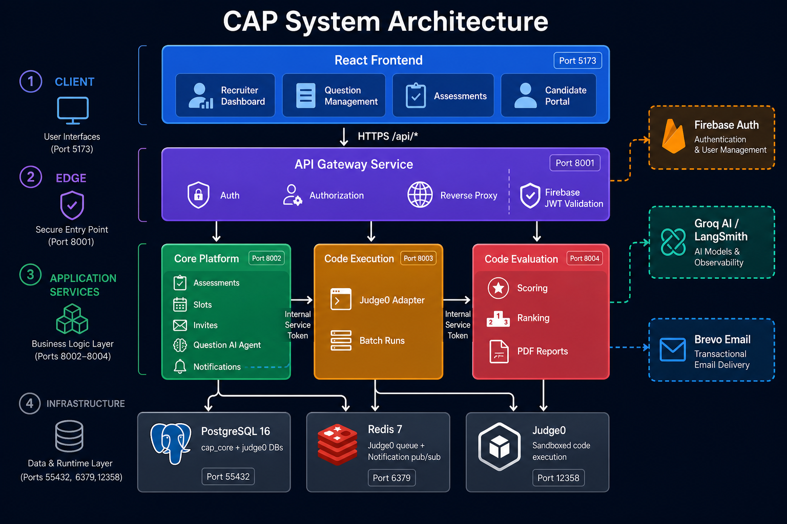
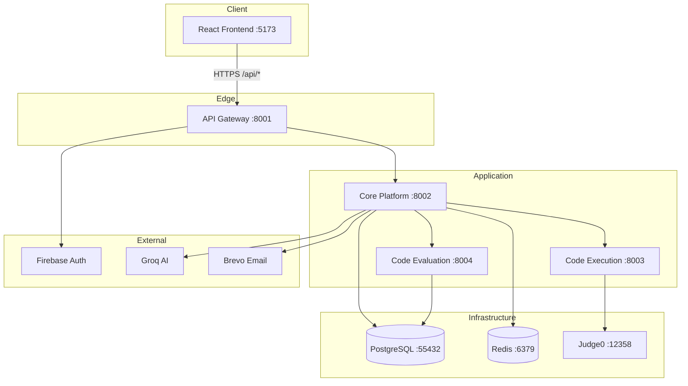
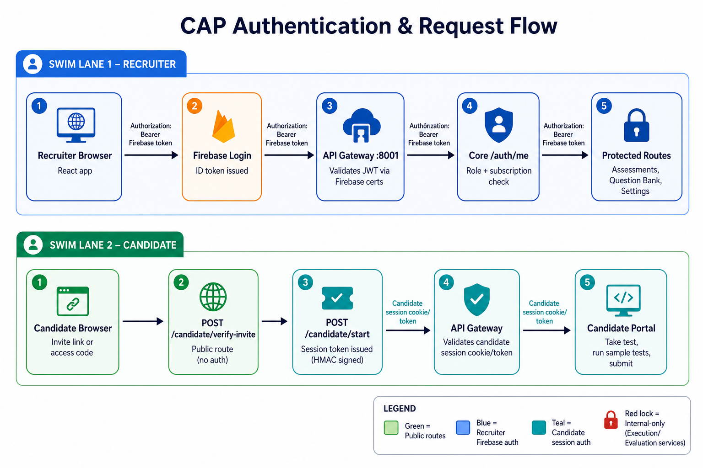
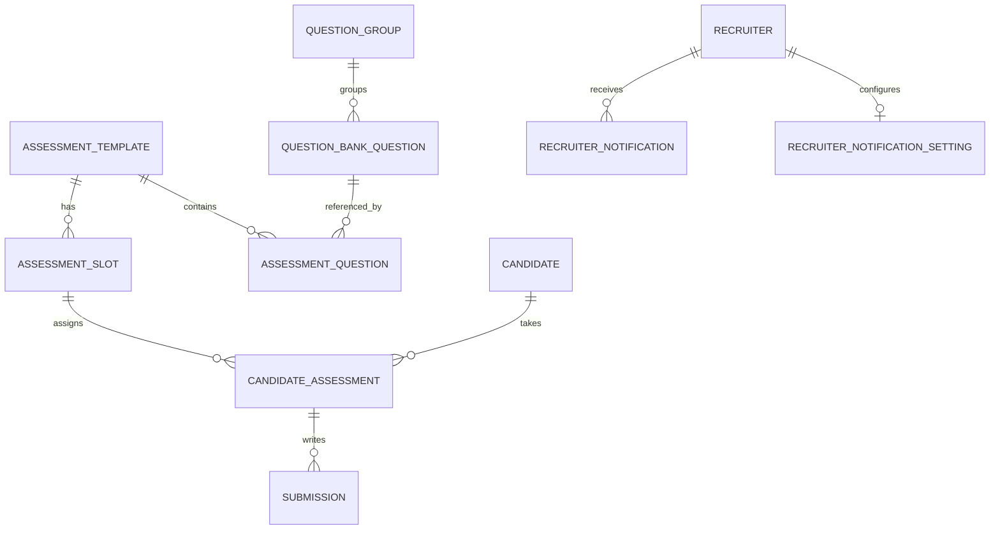
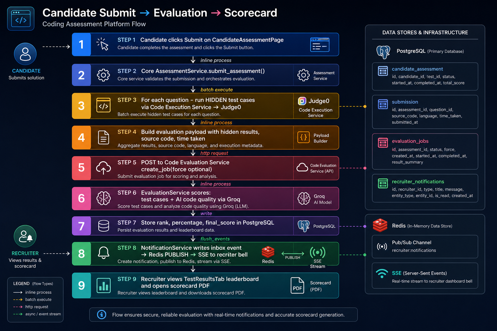
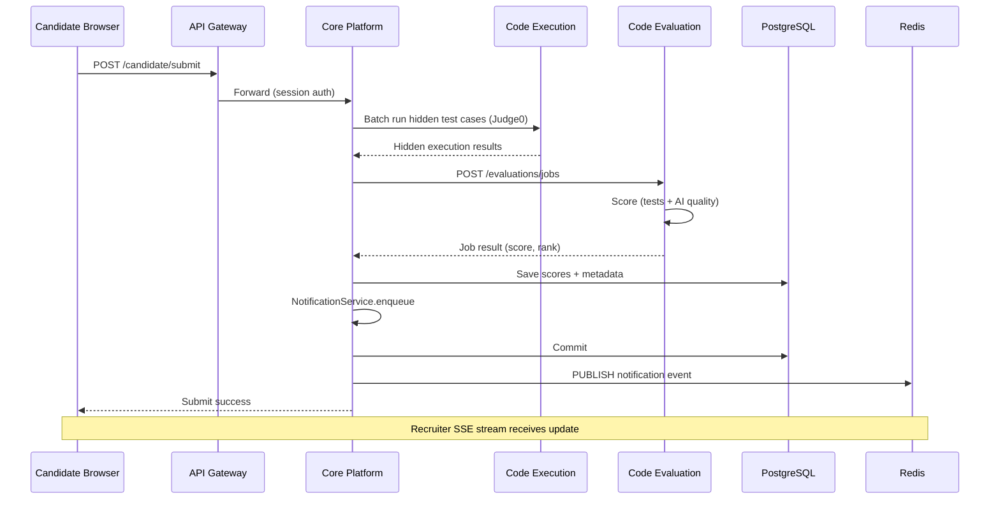
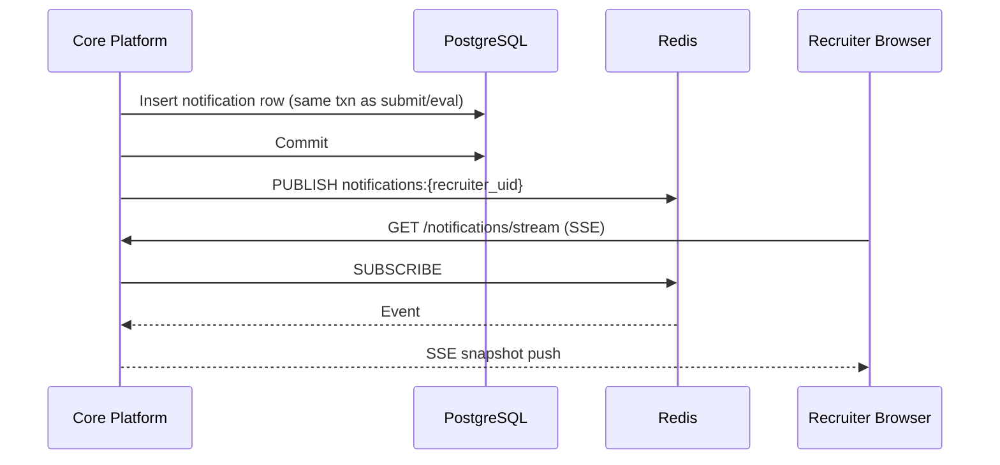
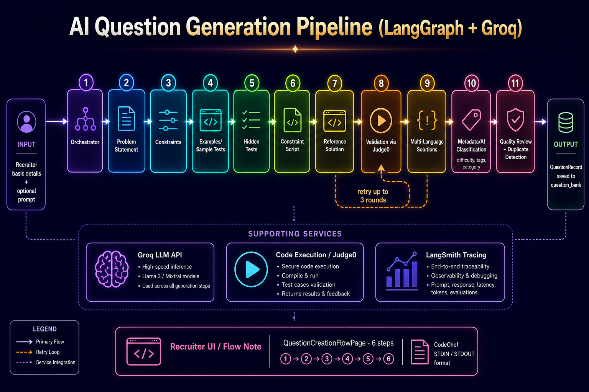
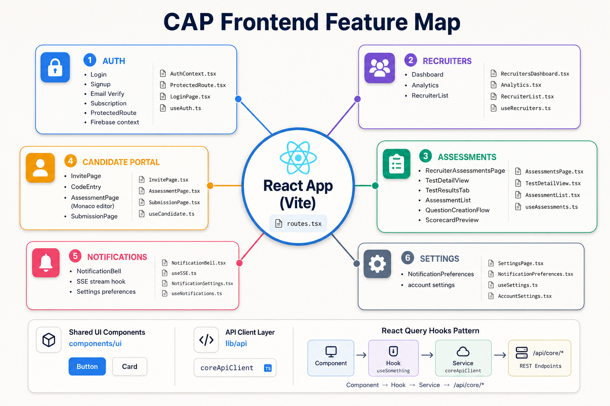

# CAP Codebase Architecture Guide

> **PDF version:** [`CODEBASE_GUIDE.pdf`](CODEBASE_GUIDE.pdf)  
> **Regenerate PDF:** `cd docs/scripts && npm install && npm run generate:codebase-guide`

This guide explains how the **Coding Assessment Platform (CAP)** is structured, how requests flow between services, and where to start reading code for each feature.

---

## Table of Contents

1. [What CAP Does](#what-cap-does)
2. [System Architecture](#system-architecture)
3. [Services at a Glance](#services-at-a-glance)
4. [Authentication & Request Flow](#authentication--request-flow)
5. [Core Data Model](#core-data-model)
6. [Key Business Flows](#key-business-flows)
7. [Frontend Architecture](#frontend-architecture)
8. [Backend Folder Layout](#backend-folder-layout)
9. [API Surface Summary](#api-surface-summary)
10. [Infrastructure & Local Dev](#infrastructure--local-dev)
11. [Where to Start Reading Code](#where-to-start-reading-code)
12. [Related Documentation](#related-documentation)

---

## What CAP Does

CAP is a **service-oriented coding assessment platform** for recruiter workflows:

| Actor | What they do |
|-------|----------------|
| **Recruiter** | Creates questions (manual or AI), builds assessments, schedules test slots, invites candidates, monitors live tests, reviews scorecards |
| **Candidate** | Joins via invite/access code, writes code in a browser IDE, runs sample tests, submits for hidden evaluation |
| **Platform** | Executes code in Judge0 sandboxes, scores submissions (test cases + AI quality), ranks candidates, generates PDF reports, sends in-app notifications |

All browser traffic goes through a single **API Gateway**. Internal services (execution, evaluation) are not exposed to the browser directly.

---

## System Architecture



### Layered view



### Service responsibilities

| Service | Port | Folder | Primary job |
|---------|-----:|--------|-------------|
| **Frontend** | 5173 | `frontend/` | Recruiter + candidate React SPA |
| **API Gateway** | 8001 | `api-gateway-service/` | Auth, authorization, reverse proxy |
| **Core Platform** | 8002 | `core-assessment-platform-service/` | Business logic, DB, AI agent, email, notifications |
| **Code Execution** | 8003 | `code-execution-service/` | Judge0 adapter — run code against stdin/stdout |
| **Code Evaluation** | 8004 | `code-evaluation-service/` | Scoring, ranking, evaluation jobs, PDF reports |
| **Judge0** | 12358 | `docker/judge0/` | Sandboxed compile + run |
| **PostgreSQL** | 55432 | — | `cap_core` DB + Judge0 DB |
| **Redis** | 6379 | — | Judge0 job queue + notification pub/sub |

---

## Services at a Glance

### API Gateway (`api-gateway-service/`)

**Entry point for all browser API calls.**

| File | Purpose |
|------|---------|
| `src/api/rest/routes/proxy.py` | Proxies `/{service}/{path}` to upstream services |
| `src/core/services/gateway_auth_service.py` | Firebase JWT, candidate session, route policies |
| `src/core/services/gateway_service.py` | HTTP relay, SSE streaming support |

Browser calls look like:

```text
GET  /api/core/assessments
POST /api/core/candidate/start
GET  /api/core/notifications/stream   (SSE)
```

The gateway validates credentials **before** forwarding. Execution and evaluation services are **never** called directly from the browser.

---

### Core Platform (`core-assessment-platform-service/`)

**The brain of CAP.** Owns recruiter data, candidate sessions, assessments, and orchestration.

| Layer | Folder | Purpose |
|-------|--------|---------|
| Routes | `src/api/rest/routes/` | HTTP endpoints (assessments, auth, candidate portal, question bank, notifications) |
| Services | `src/core/services/` | Business logic (`AssessmentService`, `QuestionBankService`, `NotificationService`, …) |
| Agents | `src/control/agents/question_agent/` | LangGraph AI question generation pipeline |
| Data | `src/data/models/postgres/` | SQLAlchemy models |
| Repositories | `src/data/repositories/` | DB access |
| Handlers | `src/handlers/http_clients/` | Outbound HTTP to execution, evaluation, Groq |
| Handlers | `src/handlers/clients/redis_broker.py` | Redis pub/sub for notification SSE |

**Key service:** `assessment_service.py` — assessments, slots, invites, submit, backfill evaluations, monitoring.

---

### Code Execution (`code-execution-service/`)

**Trusted backend-only service.** Wraps Judge0.

| Endpoint | Purpose |
|----------|---------|
| `POST /executions` | Run one code snippet with stdin |
| `POST /executions/batch` | Run one submission against many test cases |

Protected by `INTERNAL_SERVICE_TOKEN` — only Core (or other trusted services) may call it.

**Key file:** `src/core/services/code_execution_service.py`

---

### Code Evaluation (`code-evaluation-service/`)

**Scores final submissions and maintains leaderboards.**

| Endpoint | Purpose |
|----------|---------|
| `POST /evaluations/jobs` | Create + process evaluation job |
| `GET /evaluations/assessments/{id}/dashboard` | Recruiter evaluation overview |
| `GET /evaluations/assessments/{id}/candidates/{id}/report` | Candidate scorecard |
| PDF routes | Download assessment / candidate / test reports |

Also runs a **background worker** (`src/worker.py`) that polls Postgres for pending jobs (not Celery).

**Key file:** `src/core/services/evaluation_service.py`

Scoring combines:
- Hidden test case pass rate
- AI code quality signals (via Groq)
- Weighted final score + rank

---

## Authentication & Request Flow



### Recruiter flow

1. Recruiter logs in via **Firebase** in the React app.
2. Frontend sends `Authorization: Bearer <firebase-id-token>` on every API call.
3. **API Gateway** validates the JWT against Firebase public certificates.
4. For protected routes, gateway calls Core `GET /auth/me` to verify recruiter role and subscription.
5. Request is proxied to Core with recruiter identity headers.

### Candidate flow

1. Candidate opens invite link or enters access code.
2. `POST /candidate/verify-invite` and `POST /candidate/start` are **public** (no Firebase).
3. Core issues an **HMAC-signed candidate session token**.
4. Gateway validates the session token for all `/candidate/*` routes (except verify/start).
5. Candidate takes the test and submits through the portal.

### Route policy (gateway)

| Route type | Auth |
|------------|------|
| `POST candidate/verify-invite`, `POST candidate/start` | Public |
| `GET auth/firebase-config` | Public |
| `GET auth/me`, `POST auth/start-free-trial` | Firebase (subscription optional) |
| All other `/core/*` recruiter routes | Firebase + active subscription |
| All `/candidate/*` (except public) | Candidate session token |
| Execution / Evaluation APIs | Internal service token only |

---

## Core Data Model

Core PostgreSQL tables (see `core-assessment-platform-service/src/data/models/postgres/`):



| Model | Table purpose |
|-------|---------------|
| `AssessmentTemplateModel` | Recruiter-owned assessment definition |
| `AssessmentSlotModel` | Scheduled test window (start/end, duration, status) |
| `CandidateAssessmentModel` | One candidate's assignment to a slot; stores score, rank, status |
| `SubmissionModel` | Per-question source code (draft + final) |
| `QuestionBankQuestionModel` | Coding question with test cases, solutions, metadata |
| `QuestionGroupModel` | Grouped questions for bulk selection |
| `CandidateModel` | Candidate identity (email, name) |
| `RecruiterNotificationModel` | In-app notification inbox rows |
| `RecruiterNotificationSettingModel` | Notification mode preferences |

Evaluation service has its own tables (`evaluation_jobs`, `assessment_reports`) in the same Postgres instance (separate schema managed by evaluation Alembic migrations).

---

## Key Business Flows

### 1. Candidate submit → scorecard





**Code path:**
1. `candidate_portal.py` → `AssessmentService.submit_assessment()`
2. Hidden tests via `ExecutionAdapterService`
3. Payload built by `EvaluationPayloadBuilder`
4. `EvaluationAdapterService.create_job()` → evaluation service
5. Scores stored on `CandidateAssessmentModel`
6. `NotificationService` → Redis → SSE to recruiter bell

---

### 2. Evaluate Previous (re-evaluation)

When a recruiter clicks **Evaluate Previous** on a test slot:

1. Frontend sends `POST /assessments/{id}/evaluations/backfill` with `force: true` and candidate IDs.
2. Core `backfill_evaluations()` loads submitted assignments.
3. For each candidate, `_backfill_candidate_evaluation()` rebuilds the evaluation payload.
4. With `force: true`, evaluation service **resets** existing jobs and reprocesses.
5. Leaderboard and scorecards refresh.

**Key files:**
- `frontend/.../TestResultsTab.tsx` — button + candidate ID list
- `core/.../assessment_service.py` — `backfill_evaluations()`, `_backfill_candidate_evaluation()`
- `code-evaluation-service/.../evaluation_service.py` — `create_job(force=True)`

---

### 3. In-app notifications (SSE + Redis)



**Modes** (configured in Settings):
- `per_candidate` — one notification per submit/eval
- `milestone` — batched at percentage milestones
- `one_per_test` — single notification when test completes

**Key files:**
- `notification_service.py`, `notification_repository.py`
- `routes/notifications.py`
- `frontend/features/notifications/`

---

### 4. AI question generation (LangGraph)



Recruiters create questions via a **6-step wizard** or full AI generation:

| Step | What happens |
|------|--------------|
| 1 Basic details | Title, context; optional "Generate whole question with AI" |
| 2 Problem statement | Description, I/O format, constraints |
| 3 Test cases | Sample + hidden cases (CodeChef STDIN/STDOUT style) |
| 4 Solutions | Reference solution + multi-language variants |
| 5 Metadata | AI classifies difficulty, tags, category |
| 6 Review & publish | Collapsible review sections, create question |

**LangGraph node sequence** (`question_graph.py`):

```text
orchestrator → problem_statement → constraints → examples → hidden_tests
→ constraint_script → solution → validation → multi_language_solutions
→ metadata → duplicate_detection → quality_review
```

Validation runs reference solutions against Judge0 via the execution adapter. Failed validation triggers repair loops (up to 3 rounds).

**Key files:**
- `frontend/.../AssessmentsPage.tsx` — question creation UI
- `core/.../question_agent/graph/question_graph.py` — LangGraph workflow
- `core/.../question_bank_service.py` — persistence
- `core/.../routes/question_bank.py` — API including SSE draft stream

---

## Frontend Architecture



See also [`frontend/docs/architecture.md`](../frontend/docs/architecture.md) for folder conventions.

### Route map (`frontend/src/app/routes.tsx`)

| Path | Page | Feature |
|------|------|---------|
| `/recruiter/dashboard` | RecruitersPage | Dashboard + analytics |
| `/recruiter/question-management` | QuestionManagementPage | Question library |
| `/recruiter/question-management/new` | QuestionCreationFlowPage | 6-step question builder |
| `/recruiter/assessments` | RecruiterAssessmentsPage | Assessment list + detail + test slots |
| `/recruiter/settings` | SettingsPage | Notification preferences |
| `/candidate/invite/:token` | CandidateInvitePage | Invite landing |
| `/candidate/portal` | CandidateAssessmentPage | Live test (Monaco editor) |
| `/candidate/submitted` | CandidateSubmissionPage | Post-submit confirmation |

### Data flow pattern

Every feature follows the same pattern:

```text
Component  →  Hook (React Query)  →  Service (axios)  →  /api/core/...
```

Example — assessments:

```text
RecruiterAssessmentsPage.tsx
  → useAssessments.ts (useQuery / useMutation)
  → assessmentService.ts
  → coreApiClient.post("/assessments/...")
```

### Feature folders

| Folder | Responsibility |
|--------|----------------|
| `features/auth/` | Firebase login, signup, protected routes, subscription gate |
| `features/recruiters/` | Dashboard, analytics |
| `features/assessments/` | Assessments, slots, candidates, scorecards, question builder |
| `features/candidatePortal/` | Candidate test experience |
| `features/notifications/` | Bell icon, SSE stream, preferences |
| `features/codeEvaluation/` | Scorecard fetch, evaluation dashboard API |
| `features/settings/` | Settings page shell |

---

## Backend Folder Layout

Each Python service follows the same layered structure:

```text
service/
├── src/
│   ├── main.py                 # Uvicorn entry point
│   ├── config/settings.py      # Environment config (pydantic-settings)
│   ├── api/
│   │   ├── rest/
│   │   │   ├── app.py          # FastAPI factory
│   │   │   ├── routes/         # HTTP endpoints
│   │   │   └── dependencies.py # DI, auth deps
│   │   └── middleware/         # CORS, logging, errors, metrics
│   ├── core/
│   │   ├── services/           # Business logic
│   │   └── exceptions/         # Domain errors
│   ├── schemas/                # Pydantic request/response models
│   ├── data/
│   │   ├── models/postgres/    # SQLAlchemy ORM (core + evaluation)
│   │   ├── repositories/       # DB queries
│   │   └── migrations/         # Alembic (core + evaluation only)
│   ├── handlers/
│   │   └── http_clients/       # Outbound HTTP adapters
│   └── observability/          # Logging, tracing (LangSmith)
├── pyproject.toml              # uv dependencies
├── Dockerfile
└── .env.example
```

Core additionally has:
- `src/control/agents/` — LangGraph AI workflows
- `src/handlers/clients/redis_broker.py` — Redis pub/sub

---

## API Surface Summary

### Core — Recruiter assessments (`/api/v1/assessments`)

| Method | Path | Purpose |
|--------|------|---------|
| GET | `/assessments` | List assessments |
| POST | `/assessments` | Create assessment |
| PATCH | `/assessments/{id}` | Update assessment |
| DELETE | `/assessments/{id}` | Delete assessment |
| POST | `/assessments/{id}/questions` | Assign questions |
| POST | `/assessments/{id}/slots` | Create test slot |
| PATCH | `/assessments/{id}/slots/{slot_id}` | Update slot |
| POST | `/assessments/{id}/slots/{slot_id}/actions` | Pause / continue / close |
| GET | `/assessments/{id}/slots` | List slots |
| POST | `/assessments/{id}/slots/{slot_id}/candidates/import` | CSV import |
| GET | `/assessments/{id}/slots/{slot_id}/candidates` | List slot candidates |
| POST | `/assessments/{id}/evaluations/backfill` | Re-evaluate candidates |
| GET | `/assessments/{id}/evaluations/dashboard` | Evaluation overview |
| GET | `/assessments/{id}/candidates/{cid}/report` | Scorecard data |
| POST | `/assessments/{id}/slots/{slot_id}/invites` | Send invites |
| GET | `/assessments/{id}/slots/{slot_id}/monitoring` | Live monitoring |
| GET | `/assessments/{id}/slots/{slot_id}/monitoring/stream` | SSE monitoring |

### Core — Question bank (`/api/v1/question-bank`)

| Method | Path | Purpose |
|--------|------|---------|
| GET/POST | `/question-bank/questions` | List / create questions |
| POST | `/question-bank/questions/ai-draft` | Start AI generation |
| GET | `/question-bank/questions/ai-draft/stream` | SSE generation progress |
| POST | `/question-bank/questions/validate-draft` | Validate unsaved draft |

### Core — Candidate portal (`/api/v1/candidate`)

| Method | Path | Purpose |
|--------|------|---------|
| POST | `/candidate/verify-invite` | Validate invite token |
| POST | `/candidate/start` | Start session |
| GET | `/candidate/assessment` | Load test state |
| POST | `/candidate/run-sample` | Run visible test cases |
| POST | `/candidate/save-draft` | Autosave code |
| POST | `/candidate/submit` | Final submission |

### Core — Notifications (`/api/v1/notifications`)

| Method | Path | Purpose |
|--------|------|---------|
| GET | `/notifications` | List inbox |
| GET | `/notifications/unread-count` | Badge count |
| PATCH | `/notifications/{id}/read` | Mark read |
| GET/PUT | `/notifications/settings` | Preferences |
| GET | `/notifications/stream` | SSE push stream |

---

## Infrastructure & Local Dev

### Start everything

```bash
cp .env.example .env
# Copy each service .env.example → .env
docker compose up --build
```

Open `http://localhost:5173` for the frontend.

### What starts in Docker Compose

1. **postgres** + **redis** — infrastructure
2. **core-assessment-migrate** + **evaluation-migrate** — one-shot Alembic upgrades
3. **judge0-server** + **judge0-worker** — code sandbox (uses Redis queue)
4. **code-execution-service**, **code-evaluation-service**, **core-assessment-platform-service**, **api-gateway-service**
5. **frontend** — Nginx serving built React app, proxying `/api` to gateway

### Redis usage

| Consumer | Purpose |
|----------|---------|
| Judge0 worker | Job queue for compile/run |
| Core notification broker | Pub/sub channel `notifications:{recruiter_uid}` for SSE |
| Celery env vars | Defined in compose but **not used** by application code today |

### Evaluation worker

`code-evaluation-service/src/worker.py` polls Postgres with `SELECT … FOR UPDATE SKIP LOCKED` for pending jobs. This is a safety net when inline processing fails — not a Celery worker.

---

## Where to Start Reading Code

Pick the feature you care about and read in this order: **route → service → repository/model → frontend hook → component**.

| Feature | Start here |
|---------|------------|
| **Overall request routing** | `api-gateway-service/src/api/rest/routes/proxy.py` |
| **Recruiter auth** | `gateway_auth_service.py` → `core/.../firebase_auth_service.py` → `frontend/features/auth/` |
| **Create assessment + slot** | `assessments.py` → `assessment_service.py` → `RecruiterAssessmentsPage.tsx` |
| **Candidate takes test** | `candidate_portal.py` → `assessment_service.py` → `CandidateAssessmentPage.tsx` |
| **Run code (sample tests)** | `executions.py` → `code_execution_service.py` → Judge0 client |
| **Submit + evaluate** | `assessment_service.submit_assessment()` → `evaluation_service.create_job()` |
| **Scorecard / PDF** | `evaluations.py` → `evaluation_service.py` → `RecruiterScorecardPreview.tsx` |
| **Evaluate Previous** | `TestResultsTab.tsx` → `backfill_evaluations()` → `create_job(force=True)` |
| **Notifications** | `notification_service.py` → `notifications.py` → `useNotificationStream.ts` |
| **AI question generation** | `question_bank.py` → `question_graph.py` → `AssessmentsPage.tsx` |
| **Live slot monitoring** | `assessments.py` monitoring stream → `useSlotMonitoring` hook |

---

## Related Documentation

| Document | Location |
|----------|----------|
| Root README (local start, quality gates) | [`README.md`](../README.md) |
| Frontend folder conventions | [`frontend/docs/architecture.md`](../frontend/docs/architecture.md) |
| Question AI flow requirements | [`core-assessment-platform-service/docs/question-creation-ai-flow.md`](../core-assessment-platform-service/docs/question-creation-ai-flow.md) |
| Gateway API notes | [`api-gateway-service/docs/api/gateway.md`](../api-gateway-service/docs/api/gateway.md) |
| Code execution API | [`code-execution-service/docs/api/code-execution.md`](../code-execution-service/docs/api/code-execution.md) |
| Load testing | [`docs/load-testing.md`](load-testing.md) |
| COE readiness checklist | [`docs/coe-readiness.md`](coe-readiness.md) |

---

## Quick Reference — Ports

| Service | Local URL |
|---------|-----------|
| Frontend | http://localhost:5173 |
| API Gateway | http://localhost:8001/api/v1/health |
| Core Platform | http://localhost:8002/api/v1/health (internal) |
| Code Execution | http://localhost:8003/api/v1/health (internal) |
| Code Evaluation | http://localhost:8004/api/v1/health (internal) |
| PostgreSQL | localhost:55432 |
| Redis | localhost:6379 |

---

*Last updated: July 2026. For questions about a specific file or flow, ask in chat and reference the section above.*
